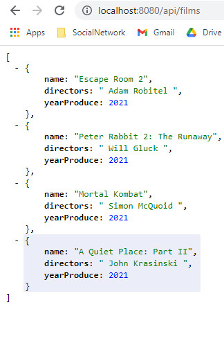
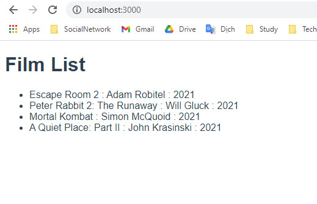

# Chạy ứng dụng Vue3 nối vào REST API do Spring Boot phục vụ

## Chạy lần lượt 2 cái để thấy được kết quả


Cài đặt Node.js trên máy tính của bạn
Sau đó mở command line gõ lệnh
```
$ cd bookvue
$ npm i
$ npm run dev
```
npm i mục đích để nhỡ tải file về chưa chạy đủ sẽ thiếu node_modules khiến app k chạy được

Dữ liệu REST API trả về do ứng dụng Spring Boot phục vụ ở cổng 8080


Giao diện client side rendering viết bằng Vue.js 3
