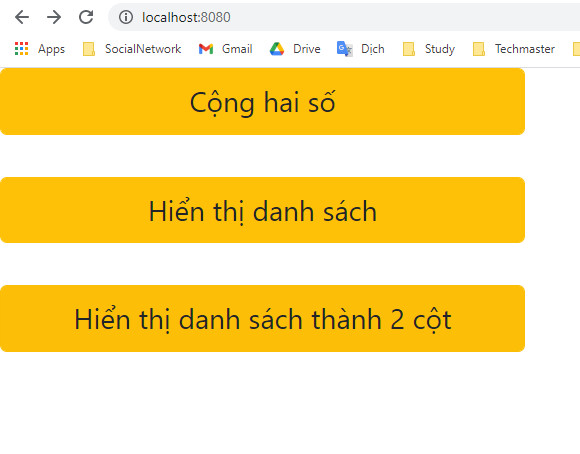
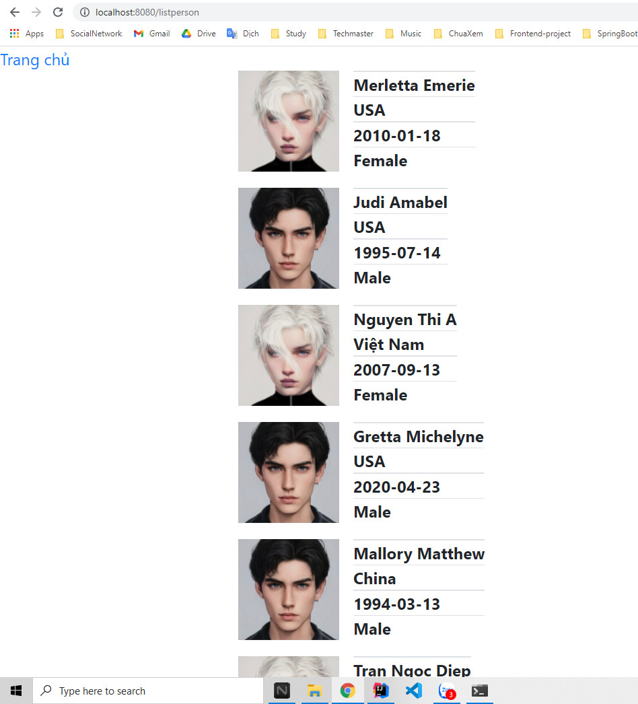
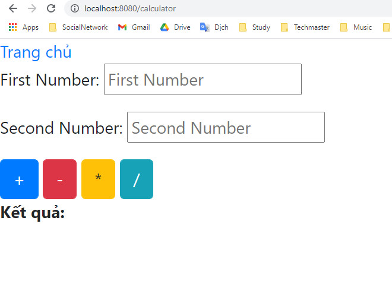
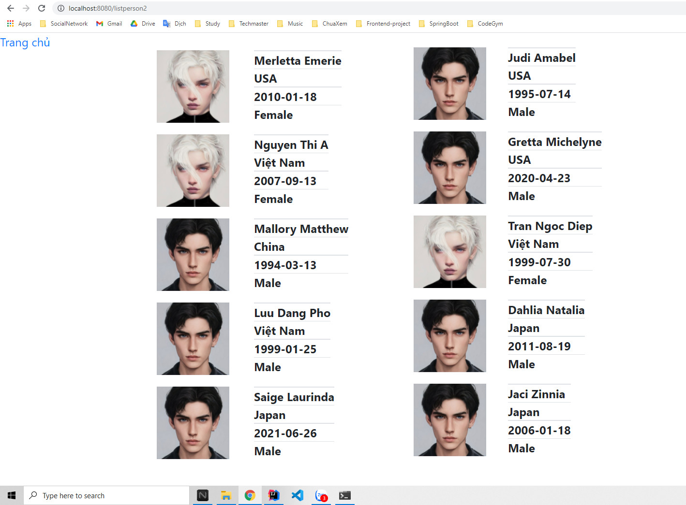

# Thymeleaf căn bản

ở file thymeleaf có sử dụng if để chọn loại ảnh cho giới tính nam và nữ

Code :

```html

<div class="img">
    

    
</div>
```
Xem chi tiết tại ảnh 2 và 4

## 1. Hiển thị danh sách



## 2. Hiển thị danh sách



## 3. Tính hai số



## 4. Hiển thị danh sách theo 2 cột




Bài có tham khảo.