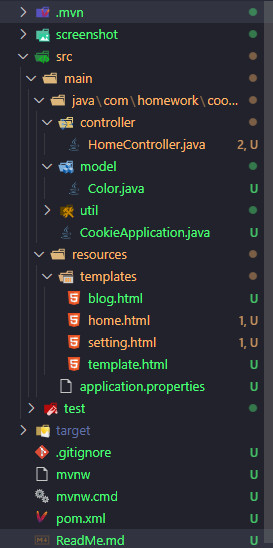
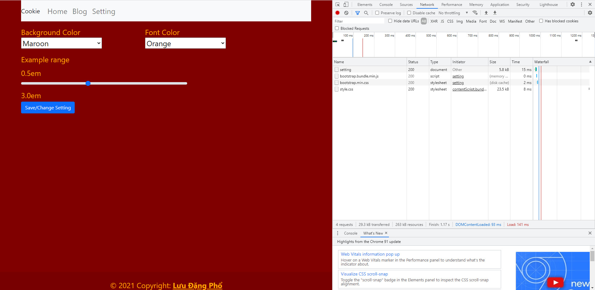
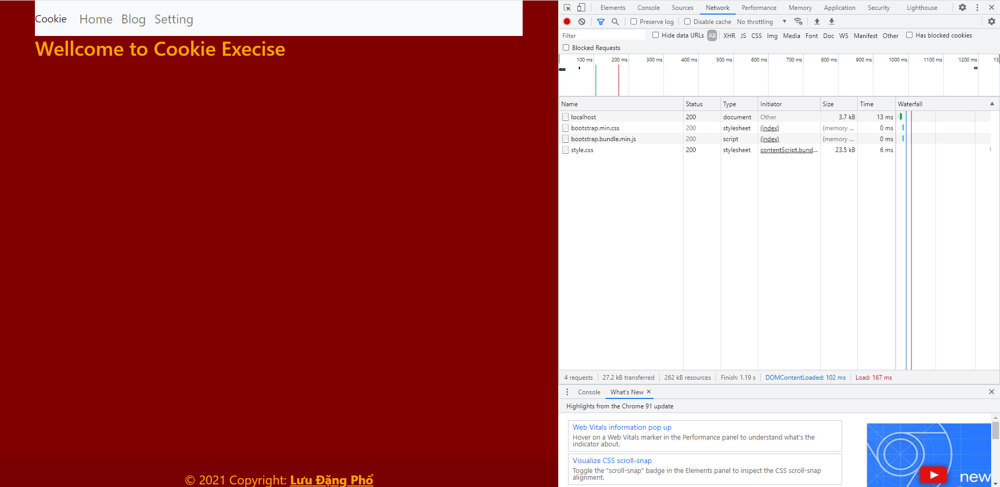
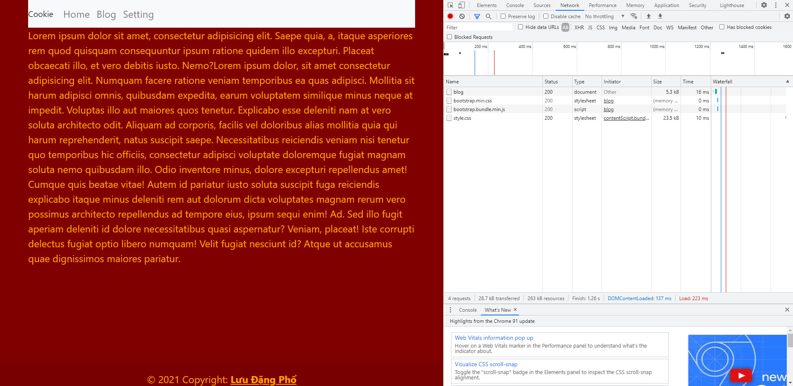
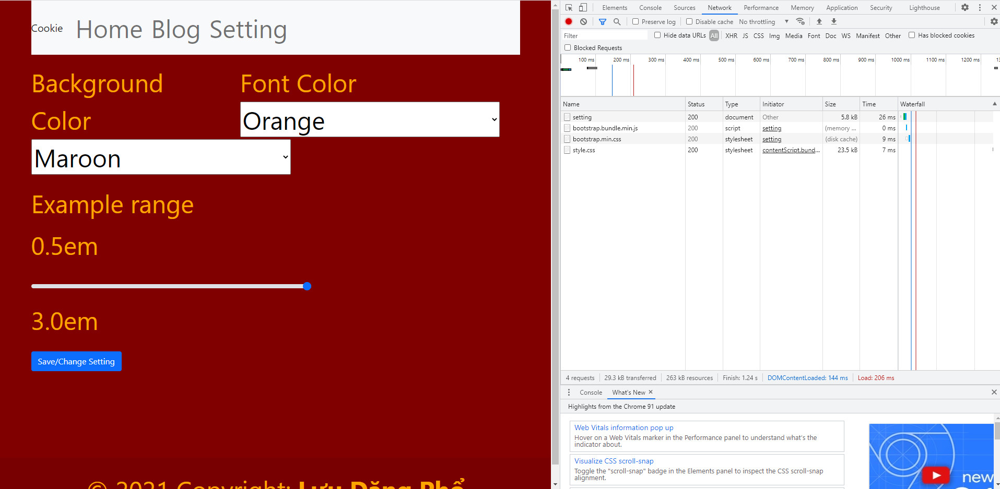

## `` Lý thuyết ``
1. Mục đích của cookie là gì?
    * `Mục đích của cookie là để lưu trữ tạm thời các thông tin theo dạng key:value nhằm phía Server nhận diện theo dõi các thông tin của client để gửi những thông tin mà không cần xác mình hay đăng nhập lại.`
    * VD: `Đăng nhập facebook: Lần đầu tiên sau khi đăng nhập - Lần sau sẽ không cần đăng nhập lại tài khoản mật khẩu.`
2. Cookie là công nghệ chỉ có trong Spring Boot. Đúng hay Sai?
    * `Sai.`
    * `Cookie được sử dụng trong tất cả loại web hay app`
3. Thuộc tính Expires/Max*Age tính bằng đơn vị gì? Ý nghĩa của nó là gì?
    * `Tính bằng đơn vị giây, là thời gian tồn tại của cookie đó trên client.`


    * VD : 
            ```86400 => Cookie có hiệu lực 1 ngày```


        ```maxAge = 365 * 24 * 60 * 60 * 1000 => 1 năm```


4. Thuộc tính Domain của Cookie có ý nghĩa gì?
    * `Domain: là domain mà cookies chúng ta hợp lệ (bánh not for everyone), mọi thứ được gửi hoặc được sử dụng từ domain này sẽ kèm theo cookies.`
5. Thuộc tính nào cho phép mã JavaScript ở client có thể đọc được giá trị của Cookie?
    * `Thuộc tính HttpOnly. False: JS có thể đọc được, True thì không.`
6. Thuộc tính Path có tác dụng như thế nào?
    * `Path: đường dẫn được chỉ định trong domain, nơi mà cookies sẽ được gửi đến server. Nó có thể là trống nếu bạn muốn thu nhận cookie từ bất kỳ thư mục hoặc trang nào`
    #
## `` Thực hành ``
### Cấu trúc thư mục 


1. Trang setting


2. Trang chủ khi thay đổi style


3. Trang blog khi thay đổi style


4. Trang setting khi để font-size to


5. Trang setting khi để font-size thấp
